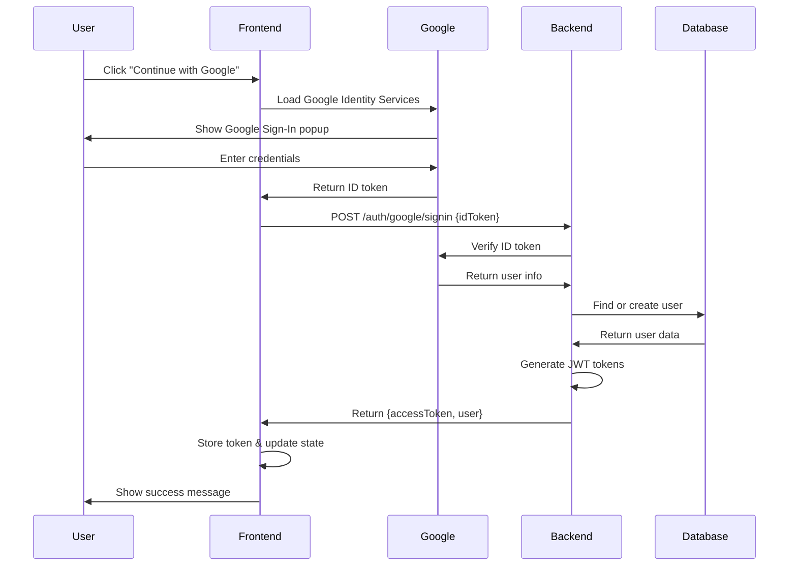

# 🔐 Complete Google OAuth 2.0 Implementation Guide

## ✅ **Implementation Status: COMPLETE**

Your Employee Management System now has a **production-ready Google OAuth 2.0 authentication flow** with the following features:

### 🎯 **What's Implemented**

#### Backend Features ✅
- **Google OAuth 2.0 Configuration** with secure token verification
- **JWT Token Management** with access and refresh tokens
- **User Model Enhancement** with Google account linking
- **Secure Authentication Routes** (`/auth/google/signin`, `/auth/google/callback`)
- **HTTP-Only Cookie Support** for enhanced security
- **Comprehensive Error Handling** with detailed logging
- **Account Linking** (existing users can link Google accounts)
- **Automatic User Creation** for new Google users

#### Frontend Features ✅
- **Modern Google Sign-In Component** with loading states
- **Custom Hook (useGoogleAuth)** for Google authentication
- **Enhanced AuthContext** with Google OAuth support
- **Production-Ready Error Handling** with user-friendly messages
- **Responsive UI** with smooth animations
- **Automatic Token Management** with secure storage

#### Security Features ✅
- **Server-Side Token Verification** using Google's official library
- **JWT Access & Refresh Tokens** with proper expiration
- **HTTP-Only Cookies** for refresh token storage
- **CORS Configuration** for cross-origin requests
- **Environment Variable Protection** for sensitive data
- **Role-Based Access Control** maintained after Google login

## 🚀 **How to Use Google OAuth**

### Step 1: Get Google Credentials

1. **Go to Google Cloud Console**: https://console.cloud.google.com/
2. **Create a new project** or select existing one
3. **Enable APIs**: Google+ API and People API
4. **Configure OAuth Consent Screen**:
   - App name: "Employee Management System"
   - User support email: your email
   - Authorized domains: `localhost` (for development)

5. **Create OAuth 2.0 Credentials**:
   - Application type: Web application
   - Authorized JavaScript origins: `http://localhost:3000`
   - Authorized redirect URIs: `http://localhost:5000/auth/google/callback`

6. **Copy your credentials**:
   - Client ID (starts with numbers, ends with `.apps.googleusercontent.com`)
   - Client Secret

### Step 2: Update Environment Variables

**Backend (.env)**:
```env
# Google OAuth Configuration
GOOGLE_CLIENT_ID=your_actual_google_client_id_here
GOOGLE_CLIENT_SECRET=your_actual_google_client_secret_here
GOOGLE_REDIRECT_URI=http://localhost:5000/auth/google/callback

# Frontend URL
FRONTEND_URL=http://localhost:3000
```

**Frontend (.env)**:
```env
# Google OAuth Configuration
VITE_GOOGLE_CLIENT_ID=your_actual_google_client_id_here
VITE_API_BASE_URL=http://localhost:5000
```

### Step 3: Restart Servers

```bash
# Backend
cd backend
npm run dev

# Frontend (new terminal)
cd frontend  
npm start
```

### Step 4: Test Google OAuth

1. **Navigate to**: http://localhost:3000/login
2. **Click**: "Continue with Google" button
3. **Sign in** with your Google account
4. **Success**: You'll see "Successfully logged in with Google account"

## 🔧 **Technical Implementation Details**

### Authentication Flow



### Security Architecture

1. **Frontend**: Receives Google ID token, sends to backend
2. **Backend**: Verifies token with Google's servers
3. **Database**: Stores user with Google ID for future logins
4. **JWT**: Issues access token for API authentication
5. **Cookies**: Stores refresh token securely (HTTP-only)

### Token Management

- **Access Token**: 15 minutes expiry, stored in localStorage
- **Refresh Token**: 7 days expiry, stored in HTTP-only cookie
- **Auto-Refresh**: Frontend automatically refreshes expired tokens
- **Secure Storage**: Refresh tokens never exposed to JavaScript

## 📱 **User Experience Flow**

### First-Time Google User
1. Clicks "Continue with Google"
2. Completes Google authentication
3. **New account created** with "Viewer" role
4. Redirected to dashboard
5. Success message: "Successfully logged in with Google account"

### Existing User (Account Linking)
1. User has existing account with email: `user@example.com`
2. Signs in with Google using same email
3. **Accounts automatically linked**
4. Can now use either login method
5. Profile picture synced from Google

### Returning Google User
1. Clicks "Continue with Google"
2. **Instant authentication** (if still signed in to Google)
3. Redirected to dashboard immediately
4. Profile picture updated if changed

## 🛡️ **Security Best Practices Implemented**

### Backend Security
- ✅ **Server-side token verification** (never trust frontend)
- ✅ **Environment variables** for sensitive data
- ✅ **HTTP-only cookies** for refresh tokens
- ✅ **CORS configuration** for allowed origins
- ✅ **Rate limiting** on authentication endpoints
- ✅ **Input validation** and sanitization
- ✅ **Error handling** without information leakage

### Frontend Security
- ✅ **No sensitive data in localStorage** (only access token)
- ✅ **Automatic token refresh** before expiration
- ✅ **Secure API communication** with proper headers
- ✅ **Error boundaries** for graceful failure handling
- ✅ **Loading states** to prevent double submissions

## 🔍 **Testing & Debugging**

### Test Endpoints

```bash
# Test backend health
curl http://localhost:5000/api/health

# Test Google OAuth endpoint (requires valid token)
curl -X POST http://localhost:5000/auth/google/signin \
  -H "Content-Type: application/json" \
  -d '{"idToken": "your_google_id_token"}'
```

### Debug Mode

Enable detailed logging by setting:
```env
NODE_ENV=development
```

### Common Issues & Solutions

1. **"Google Client ID not configured"**
   - Check `VITE_GOOGLE_CLIENT_ID` in frontend `.env`
   - Ensure no typos in environment variable names

2. **"Invalid Google token"**
   - Verify `GOOGLE_CLIENT_ID` matches in both frontend and backend
   - Check Google Cloud Console credentials

3. **CORS errors**
   - Add `http://localhost:3000` to Google Cloud authorized origins
   - Verify backend CORS configuration

4. **"Failed to initialize Google Sign-In"**
   - Check internet connection
   - Verify Google Identity Services script loads
   - Check browser console for errors

## 🚀 **Production Deployment**

### Environment Updates
```env
# Production Backend
GOOGLE_REDIRECT_URI=https://yourdomain.com/auth/google/callback
FRONTEND_URL=https://yourdomain.com

# Production Frontend  
VITE_GOOGLE_CLIENT_ID=your_production_client_id
VITE_API_BASE_URL=https://api.yourdomain.com
```

### Google Cloud Console Updates
1. Add production domains to authorized origins
2. Add production callback URLs
3. Update OAuth consent screen with production info
4. Consider verified app status for public use

## 🎉 **Success Indicators**

When everything is working correctly, you should see:

### Backend Logs
```
✅ Connected to MongoDB successfully
🚀 Server running on port 5000
🔍 Verifying Google token...
✅ Google token verified successfully
🎉 Google authentication successful for: user@example.com
```

### Frontend Experience
1. **Button loads properly** with Google logo
2. **Click triggers Google popup** (or redirect)
3. **Success message appears**: "Successfully logged in with Google account"
4. **User redirected to dashboard** with profile picture
5. **Subsequent logins are instant** if still signed in to Google

## 📞 **Support & Troubleshooting**

If you encounter issues:

1. **Check browser console** for JavaScript errors
2. **Check backend logs** for authentication errors  
3. **Verify environment variables** are set correctly
4. **Test with different Google accounts**
5. **Clear browser cache** and cookies if needed

---

## 🎯 **Your Google OAuth is Ready!**

**Access your application**: http://localhost:3000/login

**Click "Continue with Google"** and experience seamless authentication! 🚀